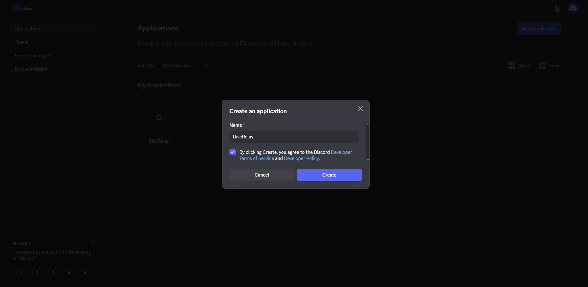
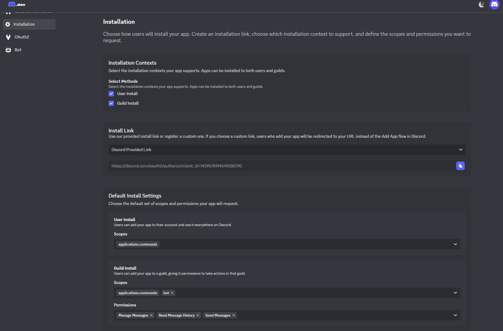
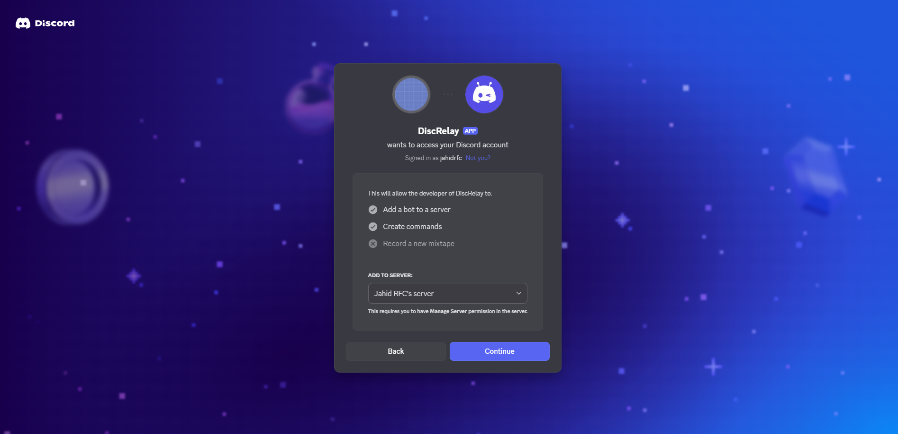
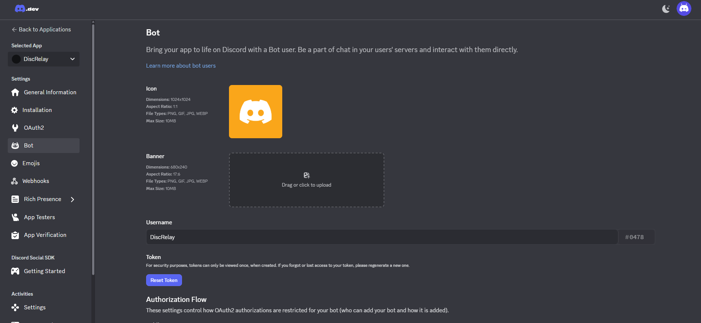
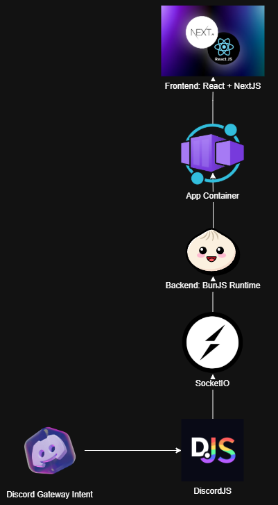
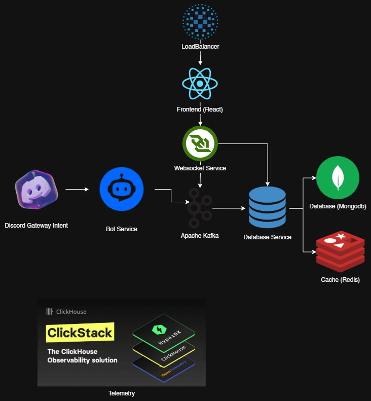

# Discord Bot Demo Project

## 🚀 Getting Started
[](https://railway.com/deploy/bun-nextjs-starter)

### 1. Create a New Discord Bot
1. Go to the [Discord Developer Portal](https://discord.com/developers/applications?new_application=true).  
   
2. Fill out the form and click **Create**.  
3. Navigate to:  
   ```
   https://discord.com/developers/applications/<bot_id>/installation
   ```
   
4. Configure installation contexts:
   - **User Install**  
     - Scopes: `applications.commands`
   - **Guild Install**  
     - Scopes: `applications.commands`, `bot`  
     - Permissions: `Manage Messages`, `Read Message History`, `Send Messages`
5. Copy the generated install link and add the bot to your server.  
   

   Example demo bot install link:  
   ```
   https://discord.com/oauth2/authorize?client_id=1439578194549280790
   ```

6. Obtain your bot token from:  
   ```
   https://discord.com/developers/applications/<bot_id>/bot
   ```
   

7. Update your environment variables:  
   ```
   DISCORD_BOT_TOKEN=<BOT_TOKEN>
   ```

---

## 🛠 Deployment

### Local
```bash
bun start
```

### Railway
Deploy directly using the Railway button above.

---

## 🎯 Design Decisions

- **Language:**  
  Chose **TypeScript** for faster prototyping with strong type safety.
- **Runtime:**  
  Using **BunJS** instead of NodeJS for speed, built‑in tooling, and modern features.
- **Bot Library:**  
  **Discord.js** provides robust utilities and reliable performance for Discord interactions.
- **Socket Library:**  
  **Socket.IO** simplifies WebSocket handling and adds built‑in safety features.
- **UI Library:**  
  **shadcn/ui** offers modern, customizable components out of the box.
- **UI Framework:**  
  **React + Next.js** enables a unified server/client environment with strong developer ergonomics.

---

## 🏗 Architecture

### Demo Architecture

## **Explanation:**

I intentionally went with a much simpler version—something that can be built quickly, deployed easily, and still demonstrate core functionality.

### **Flow Explanation**

1. **Discord Gateway Intent → DiscordJS**
   The bot receives Discord events directly using DiscordJS.

2. **Socket.IO → BunJS Backend**
   The bot forwards messages into a simple backend running on Bun:

   * Fast startup and runtime performance
   * Simpler than wiring Kafka + consumers

3. **React + Next.js Frontend (in the same container)**
   The frontend connects directly to the backend via a WebSocket connection (Socket.IO).
   Because both backend and frontend are packaged in the same container:

   * Deployment is extremely simple
   * No distributed components to manage

### **Why This Architecture?**

* This is *ideal for a short-term demo* where the goals are:

  * quickly demonstrate the bot receiving Discord messages,
  * show them in a live-updating UI,
  * avoid heavy infrastructure overhead.

### **Pros**

* Fast to build and deploy
* Almost zero operational burden
* No Kafka, no distributed transactions, no multi-node networking problems
* Perfect for a functional MVP or interview project

### **Cons**

* Vertical scaling only
* If the backend goes down, everything goes down
* No durability guarantees without additional storage
* Harder to scale beyond a certain traffic level

---

# **How to Transition from the Demo to the Scalable Version?**

I would validate the idea quickly using the simple architecture, and once usage grows or production requirements appear, I would evolve it into the scalable design:

* Move message ingestion to Kafka
* Introduce separate consumer instances
* Replace in-memory state with Redis
* Persist messages in MongoDB
* Deploy WebSocket gateway separately
* Add ClickHouse for proper observability

This ensures we don’t over-engineer prematurely but have a clear path to scale when needed.

---


### Scalable Architecture

## **Explanation:**

This architecture represents the direction I would take if this system needed to operate reliably at scale—serving thousands of concurrent Discord events, with real-time updates to the UI, persistent storage, telemetry, and opportunities for horizontal scaling.

### **Flow Explanation**

1. **Discord Gateway Intent → Bot Service**
   The bot receives events such as messages, reactions, and user interactions directly from Discord.

   * This is isolated as its own service to allow independent deployment and scaling.

2. **Bot Service → Apache Kafka**
   Instead of processing events immediately, they are pushed into Kafka.

   * Kafka acts as a buffer and event bus, allowing us to scale consumers independently.
   * It protects the system from sudden event spikes.

3. **Kafka Consumers → Database Service**
   A consumer service pulls events, transforms them, and writes to persistent storage.

   * **MongoDB** stores messages and metadata (durable, flexible document schema).
   * **Redis** stores fast-changing state or cached computed results.

4. **Real-Time Updates via WebSocket Service**
   The frontend connects to a WebSocket gateway, which receives updates from:

   * Kafka consumers
   * Database changes
     This means clients see updates instantly without polling.

5. **Frontend Behind Load Balancer**
   The React frontend can scale out horizontally behind a load balancer without session stickiness issues because:

   * WebSocket connections are managed independently,
   * state is externalized in Redis / DB.

6. **Telemetry with ClickHouse + ClickStack**
   Event and performance metrics are streamed into ClickHouse, enabling deep observability:

   * per-message latency,
   * system load,
   * throughput,
   * error patterns.

### **Why This Architecture?**

* **Elastic and fault tolerant**
* **No single bottleneck**
* **Asynchronous decoupling using Kafka**
* **Every major component can scale independently**
* **True real-time delivery**
* **Well-instrumented for reliability and performance monitoring**

### **Pros**

* Very scalable and production-grade
* Can sustain large, bursty message loads
* Encourages microservice isolation and loose coupling
* Strong operational visibility

### **Cons**

* Higher operational complexity
* More services to deploy and maintain
* Longer development time for initial MVP

---
